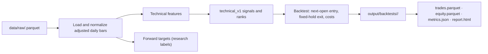

# Quant-OSINT repository guide

Quant-OSINT is a small, reproducible quantitative-research project. Its working
path today is a **daily, long-only technical strategy** that uses local market-data
snapshots. It is a research/backtesting tool: it does not download data or place
orders.

This guide explains the current Phase 1 implementation and calls out the pieces
that are intentionally reserved for future work.

## The idea in one minute

For every ticker and trading day, the project:

1. reads an OHLCV Parquet snapshot from `data/raw/`;
2. adjusts the price bars for splits and dividends;
3. calculates technical indicators using data available at that day's close;
4. selects up to the strongest eligible tickers;
5. enters at the *next* trading day's adjusted open, exits after a fixed number
   of sessions, and deducts trading costs;
6. saves the trades, a simplified equity curve, metrics, an HTML report, and
   lineage information in a new immutable run directory.



## Repository map

| Location | Purpose |
| --- | --- |
| `configs/` | TOML inputs describing the universe, feature windows, strategy settings, and costs. |
| `data/raw/` | Input snapshots: one Parquet file per ticker. This is the only market-data input to Phase 1. |
| `data/processed/` | Normalized combined market dataset made by `quant ingest market`. |
| `data/features/` | Materialized technical features and separate forward-return targets. These are reproducible intermediates. |
| `src/quant_osint/data/market.py` | Validates raw files, adjusts OHLC prices, and hashes source inputs for lineage. |
| `src/quant_osint/features/` | Builds technical features and research-only forward targets. |
| `src/quant_osint/strategies/technical_v1.py` | Turns indicators into eligibility, rankings, and selected positions. |
| `src/quant_osint/backtest/` | Applies trading timing, position cap, costs, and performance calculations. |
| `src/quant_osint/reports/html.py` | Builds a standalone HTML report from a saved run. |
| `src/quant_osint/cli.py` | Command-line orchestration for ingesting, building features, backtesting, and reporting. |
| `tests/` | Unit tests for the timing, features, strategy cap, output lineage, and report contents. |
| `output/backtests/` | Immutable result bundles. Safe to compare across configurations. |

`src/quant_osint/data/congress.py`, `data/sec.py`, `features/congress.py`, and
`strategies/congress_v1.py` are empty placeholders. Congress/SEC data is not part
of the current executable workflow.

## Setup and data contract

Install the locked Python environment from the repository root:

```bash
uv sync --all-groups
```

Place a file for each ticker in `data/raw/`, for example
`data/raw/XLK.parquet`. Each file must contain these columns exactly:

```text
Date, Open, High, Low, Close, Volume, Adjusted Close
```

The loader assigns the ticker from the filename, converts `Date` to a normalized
date, and multiplies Open/High/Low/Close by `Adjusted Close / Close`. That makes
the bars continuous across splits and dividends. Volume is retained as supplied.

The default universe is listed in `configs/market-us-liquid.toml` and
`configs/technical-v1.toml`. If a configuration names a ticker, its matching
Parquet file must exist. No external data provider is called.

## Run the baseline strategy

From the repository root, use:

```bash
# Optional but useful: validate and materialize the normalized market dataset.
uv run quant ingest market --config configs/market-us-liquid.toml

# Build indicator and target tables for inspection or downstream research.
uv run quant features build --set technical-v1

# Build features again, generate signals, run the backtest, and create a report.
uv run quant backtest configs/technical-v1.toml
```

The `backtest` command is self-contained: it re-materializes its features, so
the preceding `features build` step is not required before every backtest.

To rebuild the newest report after inspecting or changing the reporting code:

```bash
uv run quant report latest
```

Each backtest prints a path like `output/backtests/20260811T...-<hash>/`.
Open that directory's `report.html` in a browser. The folder also contains:

| File | What it answers |
| --- | --- |
| `config.toml` | Exactly which configuration was run. |
| `metadata.json` | Run time, Git commit, source-data hash, configuration hash, and status. |
| `trades.parquet` | Every accepted trade with signal, entry, exit, gross/net return, and costs. |
| `equity.parquet` | The aggregated return observations, equity series, and active-position count. |
| `metrics.json` | Return, volatility, Sharpe/Sortino, drawdown, hit-rate, turnover, and trade-count summaries. |
| `report.html` | Portable visual report with equity, drawdown, monthly-return, and trade-return charts. |

Run directories are never reused. This preserves comparisons between experiments.

## What `technical-v1` does

`configs/technical-v1.toml` supplies both indicator windows and trading rules.
With its defaults, the strategy computes per ticker:

- one-day, 5-day, and 20-day close-to-close momentum;
- 20-day and 50-day moving averages;
- 14-day RSI and ATR;
- 20-day return volatility; and
- a 20-day volume z-score.

On each signal date, a ticker is eligible when all of these are true:

```text
20-day momentum > min_momentum_20
adjusted close > 20-day moving average > 50-day moving average
volume z-score > min_volume_z
```

Eligible tickers are ranked by 20-day momentum. The top `max_positions` are
marked `selected`. The defaults choose up to five positions, hold each for five
sessions, require positive 20-day momentum, and charge 1 bp commission plus 5 bp
slippage on *each side* of a trade.

### Timing and look-ahead protection

The signal uses the closing price on the signal date. The backtest deliberately
does **not** buy at that same close:

```text
signal at close on D0 → enter at adjusted open on D1 → exit at adjusted close on D5
```

The fixed holding period is measured by ticker trading rows. The implementation
also enforces the portfolio cap across overlapping trades: an exit at a day's
close cannot fund a new same-day open entry.

Forward returns in `technical-v1-targets.parquet` are separate from the feature
table. They are research labels only and are not used by `technical-v1` to make a
decision.

## Test different configurations

The easiest way to run an experiment is to copy the baseline config, change a
small number of settings, and backtest that copy:

```bash
cp configs/technical-v1.toml configs/technical-fast-momentum.toml
# Edit configs/technical-fast-momentum.toml, then:
uv run quant backtest configs/technical-fast-momentum.toml
```

Useful first experiments include changing:

| TOML field | Effect |
| --- | --- |
| `strategy.max_positions` | Number of simultaneous positions permitted. |
| `strategy.holding_days` | Number of ticker sessions from signal to exit. |
| `strategy.min_momentum_20` | Minimum 20-day momentum required to qualify. |
| `strategy.min_volume_z` | Volume-activity filter. |
| `features.*_days` | Lookback windows used by the indicators. |
| `market.universe` | Tickers considered; each needs a raw file. |
| `costs.commission_bps`, `costs.slippage_bps` | Per-side trading assumptions. |
| `experiment.horizons` | Forward-label horizons written to the targets file. These do not alter trades. |

Keep the same raw data when comparing configurations. The `metadata.json` source
hash and copied config make it possible to confirm that two runs only differ in
the assumptions you intended to test.

### Add a genuinely new strategy rule

There is not yet a generic strategy plug-in registry: the CLI directly imports
`technical_v1.generate_signals`. To implement a new rule set, the usual path is:

1. Add any required point-in-time feature in `src/quant_osint/features/`.
2. Create a strategy module with a `generate_signals(features, settings)` function.
   It should return the input rows with a Boolean `selected` column. Keeping
   `signal` and `rank` is useful for inspection.
3. Change the CLI dispatch in `src/quant_osint/cli.py` so the desired config
   selects that generator. At present, every backtest calls `technical_v1`.
4. Add focused tests for eligibility, ranking, timing, and any data edge cases.
5. Give the strategy its own TOML config and run it as a separate experiment.

The existing backtest engine can be reused as long as the strategy remains
long-only and produces `selected` rows with `ticker`, `date`, `open`, and `close`.

## How the backtest calculates results

For every selected row, the engine proposes one trade:

```text
gross return = exit adjusted close / next-session adjusted open - 1
round-trip cost = 2 × (commission bps + slippage bps) / 10,000
net return = (1 + gross return) × (1 - round-trip cost) - 1
```

Candidates are ordered by entry date then ticker; candidates beyond the active
portfolio cap are skipped. Returns are currently aggregated on **exit dates** by
averaging the net returns of trades that exit on the same date. Consequently, the
equity curve is a transparent trade-outcome series, not a daily mark-to-market
portfolio valuation. Interpret annualized metrics with that limitation in mind.

## Tests and development checks

Run the test suite:

```bash
make test
# or: uv run pytest
```

Run linting and the complete local check:

```bash
make lint
make check
```

The key behavioural tests are:

- `tests/test_phase1.py`: targets are not feature columns, signals enter next
  open, costs reduce returns, and the strategy selection cap works.
- `tests/test_phase0.py`: configuration hashing and immutable run metadata.
- `tests/test_reports.py`: the generated report embeds all core charts.

## Current boundaries and practical cautions

- This project assumes local daily data; it neither fetches nor validates vendor
  provenance beyond file structure and a content hash.
- Results use adjusted OHLC bars. Be consistent about this if comparing against
  an external unadjusted-price system.
- Missing rows, delistings, market calendars, borrow costs, taxes, cash balances,
  intraday execution, and corporate-action mechanics beyond price adjustment are
  not modeled.
- The strategy is long-only. Shorting, weighting schemes other than equal trade
  notionals, and dynamic portfolio rebalancing are not implemented.
- A successful backtest is evidence about this dataset and these assumptions, not
  evidence of live trading performance.

## Suggested orientation order for a new contributor

Read `configs/technical-v1.toml`, then `src/quant_osint/cli.py`, followed by the
four implemented layers in order: `data/market.py`, `features/technical.py`,
`strategies/technical_v1.py`, and `backtest/engine.py`. Finally, run the tests and
one baseline backtest with a local data snapshot. That follows the same path the
application uses end to end.
